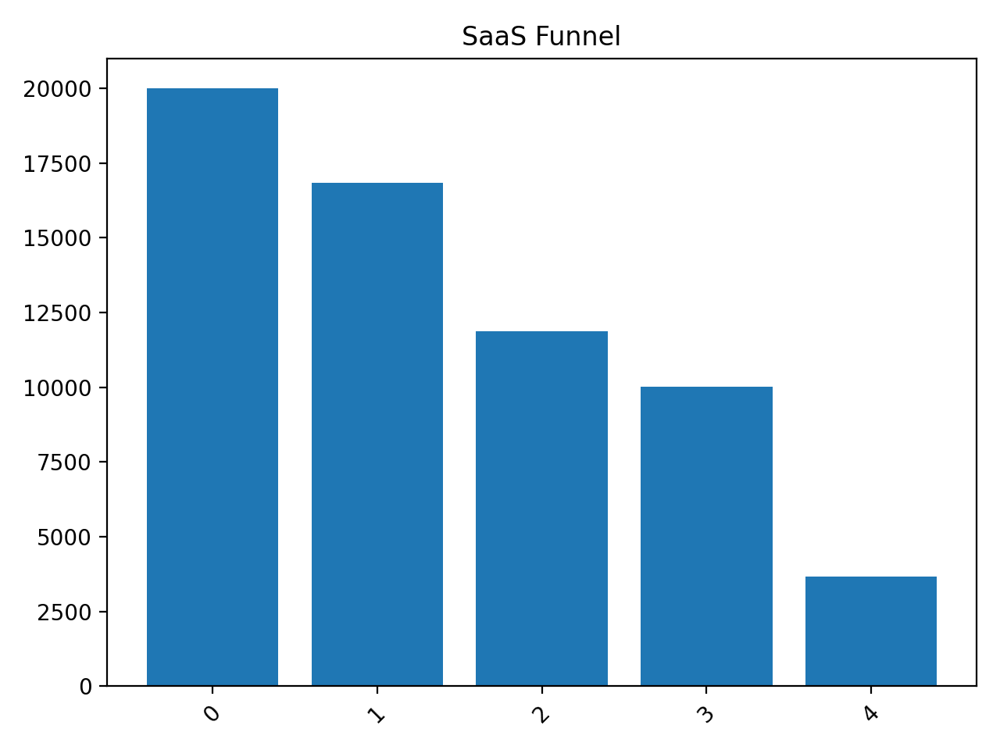
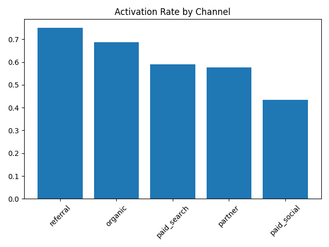
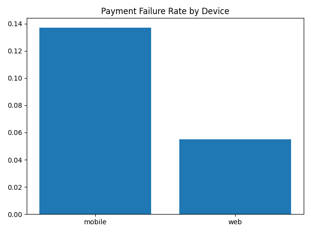

# SaaS Funnel Leakage & Revenue Impact Analysis

## Overview

This project simulates a 20,000-user B2B SaaS customer journey to identify revenue leakage across the acquisition → activation → trial → subscription funnel.

The goal was to:

- Identify key funnel bottlenecks
- Diagnose root causes of conversion drop-offs
- Quantify financial impact (ARR)
- Prioritize growth initiatives using data

This project combines product analytics, growth analysis, and revenue modeling.

---

## Dataset

Synthetic event-based SaaS dataset generated using Python.

- **20,000 users**
- **229,000+ events**
- **3,654 subscriptions**
- Multi-session behavioral simulation
- Channel-level and device-level behavioral differences
- Payment failures and churn modeling included

---

## Funnel Conversion

| Step | Users | Conversion from Previous |
|------|------:|-------------------------:|
| Signup | 20,000 | — |
| Onboarding Start | 16,827 | 84% |
| Activation (Create Project) | 11,876 | 70.6% |
| Trial Start | 10,020 | 84.3% |
| Subscription | 3,654 | 36.4% |

---

## Key Findings

### 1️⃣ Activation is the Primary Growth Lever

- Activated users convert at **30.3%**
- Non-activated users convert at **0.7%**
- **43x conversion uplift**

Improving activation by 5 percentage points would result in:

- +303 additional paid users
- **~$296K ARR increase**

---

### 2️⃣ Paid Social Underperforms on Activation

Activation Rate by Channel:

| Channel | Activation Rate |
|---------|----------------:|
| Referral | 75% |
| Organic | 68.7% |
| Paid Search | 59.1% |
| Partner | 57.5% |
| Paid Social | 43.4% |

Closing the activation gap between Paid Social and Organic could generate:

- +386 additional paid users
- **~$377K ARR annually**

---

### 3️⃣ Mobile Checkout Friction

Trial → Paid Conversion:

| Device | Conversion |
|--------|-----------:|
| Web | 38.1% |
| Mobile | 32.4% |

Payment Failure Rate:

| Device | Failure Rate |
|--------|-------------:|
| Web | 5.5% |
| Mobile | 13.7% |

Mobile experiences a **2.5x higher payment failure rate**.

Reducing mobile failure to web levels could generate:

- +91 paid users
- **~$89K ARR annually**

---

## Revenue Opportunity Summary

| Initiative | Estimated ARR Impact |
|------------|--------------------:|
| Improve Paid Social Activation | ~$377K |
| Reduce Mobile Checkout Failures | ~$89K |
| Activation Improvement (5pp overall) | ~$296K |

**Total Identified Revenue Opportunity: ~$466K+ annually**

---

## Visualizations

### Funnel Overview


### Activation by Channel


### Payment Failure Rate by Device


---

## Strategic Recommendations

1. Prioritize activation improvements for Paid Social users
2. Optimize mobile checkout reliability and payment UX
3. Focus growth efforts on high-performing channels (Referral & Organic)
4. Improve onboarding UX to increase activation rate

---

## Tech Stack

- Python
- Pandas
- NumPy
- Matplotlib
- Faker (data simulation)
- Jupyter Notebook

---

## How to Run
```
pip install -r requirements.txt
python src/generate_data.py
```

## Why This Project Matters

This project demonstrates:

- Funnel analytics  
- Product & growth analysis  
- Segmented conversion modeling  
- Checkout friction diagnostics  
- Revenue impact simulation  
- Strategic prioritization using data  

It bridges the gap between analytics and business decision-making.